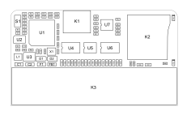
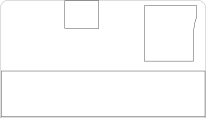
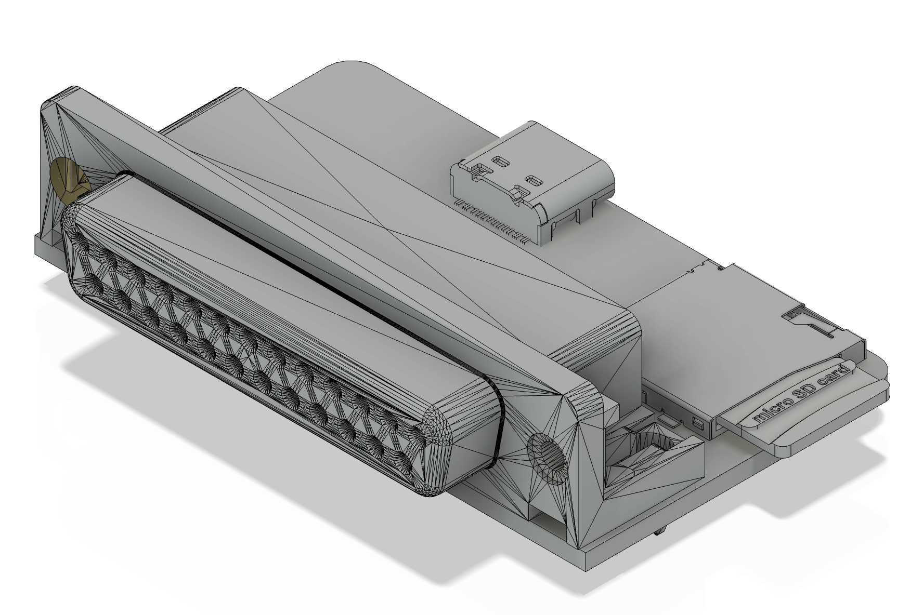

# Creation of a circuit enclosure

The goal of this project is to create an enclosure for the [SCSI Knife Pocket](https://github.com/Siliconinsid/SCSIknifePocket) circuit.

## A prerequisite to the goal
Such a goal is generally fulfilled thanks to a 3D model of the finished circuit, a side-product of the CAD worflow used to design the circuit, used as a guide to design the enclosure around it.

In this case, the author has provided a PDF image of the layout of the main PCB. A bit of elaboration is needed before to tackle the main goal, the enclosure itself.

 

**Note:** In addition to the main goal, attention will be paid to the procedures, they must be simple and reproducible with further versions of the circuit. 

Open Source tools used in this part of the project: 

* **Inkscape** is used to work on the SVG file 
* **FreeCAD** is used for the mechanical design.

An account on the [GrabCAD portal](https://grabcad.com) is also used.

The overall procedure is to start from the layout of the PCB, simplying it then import its geometry into the CAD system used for the enclosure design. The geometry of the circuit is transfered from the SVG to the CAD system, then ready-made 3D model of the components are added to recreate a realistic volumetry of the fully equiped circuit.

## Prerequisite elaboration
### Simplifying the layout
The input is the file schematcs/layout.pdf, imported in Inkscape.
Most components of the circuit are low profile CMS components which require next to nothing in terms of overhead space allocation. Therefore, only the footprint of the largest ones, two connectors and a memory card reader are retained and their precise placement transferred to FreeCAD. Only 4 paths remain, the PCB outline and the footprint of the main components.

The result is exported as pcb_simplified.svg

 

### Importing in the CAD system
FreeCAD is divided in multiple *Workbenches*, each one is specialized in some specific tasks.

* *Sketcher*: Used to streamline the paths and to reduce all of the remaining "Degrees Of Freedom" or DOF. 
* *Draft*: Used to transform the drawing into CAD sketches.
* *Part*: Used to compose a simplified 3D model of the circuit.

The import happens in the *Draft* workbench, Select Import... in the File menu, select simplified_pcb.svg, then the second option "As a geometry". Four objets are added to the tree of the model. Select each of them then click on the Red/Blue icon to transform each path into a sketch.  Rename them for an easy selection.
Change to the *Sketcher* Workbench. The PCB and the Card Reader have arcs composed with multiple segments causing some green cluttering of the drawing.
    * Replace multiple segments with single arcs primitives. Deactivate all of the constraints, the total number of DOFs is then displayed. 
    * Reduce this number to nothing, with the paths highlighted in a single colour: To do so, add a "blocker" (red X in a circle) constraint on some of the edges. If the addition is not effective in decreasing the number of DOFs, just undo it and try another one. Additional attention is required for the PCB outline which needs to be a closed path. Examine the 6 vertices, if any does not seem a perfect circle, select them and apply a coincidence constraint, reducing all neighbour points to a single one.

### Design and populate the Circuit 3D model

* Give some thickness (about 1.6 mm) to the PCB, by extruding the PCB outline upwards in the *Draft* workbench. This is the only **design** operation performed with this CAD tool.
* Populate the PCB with library 3D models of the 3 components. GrabCAD is a convenient resource for them.    
    * [The DB-25 female angle connector, labeled "AB2_DB25\_F\_RA"](https://grabcad.com/library/db25-female-right-angle-connector-1)
    * [The USB-C female connector, labeled "HRO_TYPE-C-31-M-12"](https://grabcad.com/library/type-c-31-m-12-1)
    * [The TF card reader, labeled "L-KLS1-TF-0.03\_ALL001"](https://grabcad.com/library/tf-01a-1) 

To insert one of those library component, you can download them from the GrabCAD portal through Community/Library menu, after creation of a free account. Ideally, the files are in .STEP format, otherwise on-line tools exist to convert them. The STEP file will be opened as separate document in FreeCAD then the file with the abovementioned labels can be dragged and dropped into the PCB project tree view.

Each objet in FreeCAD can be "placed", then on top of the applied changes from the library view, they can be moved around or rotated again.

Select the component in the tree, in the bottom panel activate the "Data" tab to see and edit the values.

* Placement
    * Angle: ± multiples of 90° to orient the component
    * Axis: Only 1 and 0 values to indicate X, Y or Z 
    * Position: x,y,z distances in millimeters to move the component into its position, use top and front view for precise alignement, it is also recommended to toggle the visibility of the PCB (Eye icon in front of it or selection+spacebar). A vertical z nudge of 1.6 mm (thickness of PCB) is needed to place the component on the top surface of the PCB.
  
Should an additional transform be needed, change to "Part" workbench, select component in the tree and right-click for contextual menu, and select first option, arrows and circular handles allow for additional placement movements.

Finally, select the root of the tree, then select from menu File > Export, choose STEP as the output format, and the circuit 3D model is now saved as pcb_simplified.step

Achievement unlocked! Prerequisite ready! 

 

### Design of the enclosure

FreeCAD was first envisaged to finalize the design of the enclosure, however current bugs or lack of explainantion on some recent changes have made it impossible to use. The free version of Autodesk Fusion 360 was used instead of the Open Source tool. After many attemps, the design with a sleeve and a back cover was retained.

**Note:** A SCSI disk DB-25 should be of male gender, however only the female model was available as a 3D model. This has no impact on the design itself.

- Front view without sleeve
 

- Front view with sleeve
 

- Back view without back cap
 

- Back view with back cap
 

- Long screw could be added to secure the plug to the Mac. [Digikey](https://www.digikey.fr/fr/products/detail/norcomp-inc/160-000-050R031/1008061) has one reference for them.

- And finally...
